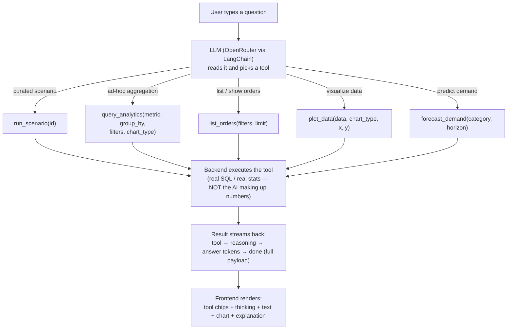
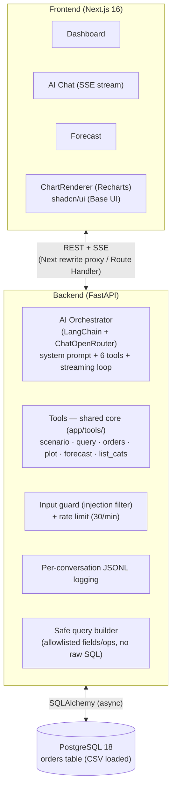
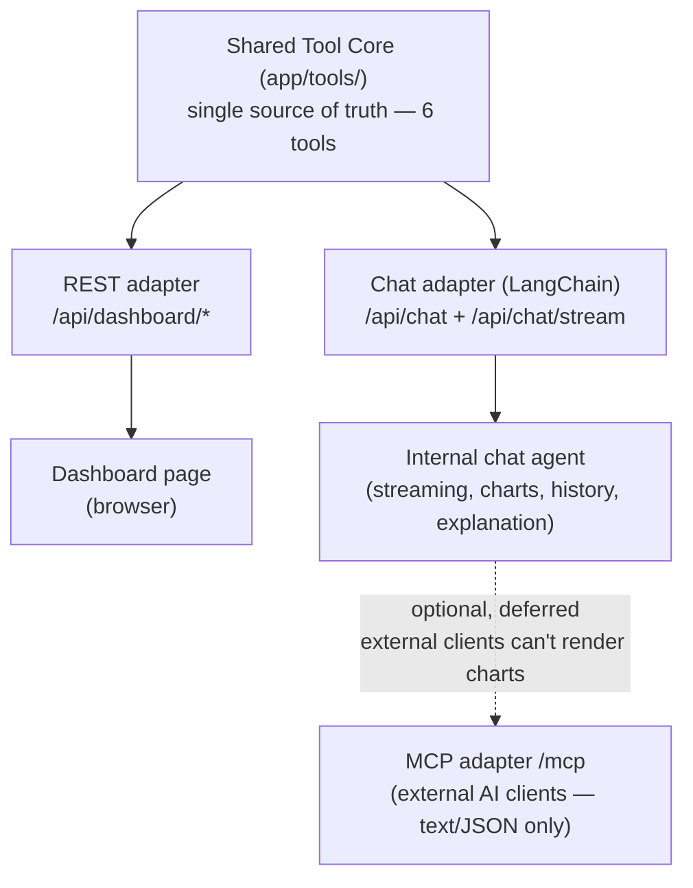

# Logistics AI Analytics Dashboard — Overview & Architecture Guide

## 1. What Is This Project?

This project is an **AI-powered Logistics Analytics Dashboard** — a control center for a shipping company. Imagine a logistics manager who oversees hundreds of shipments across carriers (FedEx, UPS, DHL, etc.) every month. Currently, operational data sits in flat spreadsheets. This application turns that raw logistics data into an **interactive, intelligent web dashboard** that lets people ask questions in plain English and get answers visually.

The app does three things, each progressively smarter:

1. **Descriptive — Show me what happened**
   A dashboard with numbers and charts. "We shipped 400 orders, 55 were late, our on-time rate is 84.7%."

2. **Diagnostic — Help me understand why**
   A streaming chat where you type questions like "Which carrier has the highest delay rate?" and the system gives you a live answer + a chart + a collapsible explanation of how it got that answer.

3. **Predictive — Tell me what's coming**
   A forecasting tool where you pick a product category and it predicts how much demand to expect in the next few months (three statistical methods, fitted over history + projected forward), so you can plan inventory.

---

## 2. Data Overview (`server/data/logistics_data.csv`)

The dataset is essentially a table of **400 shipping transactions** spanning a full year (Jan 1, 2025 – Dec 30, 2025). Each row is one order.

### Example Row (in plain English)

> Client **CL-1023** placed order **ORD-0001** on **Oct 19, 2025**. It was **2 units** of **PAPER** (SKU `PAPER-0197`) at **$13.11** each, totaling **$26.22**. It shipped from **London** via **DHL** to **Leeds**, out of warehouse **LON-FC1** in the **UK** region. It was delivered on **Oct 22** — that's **3 days**. Status: **delivered**. No promotion.

### Key Dimensions (what you can slice by)

| Dimension         | What it means          | Count & Values                                                              |
| ----------------- | ---------------------- | --------------------------------------------------------------------------- |
| Carrier           | Who shipped it         | 9 — FedEx, UPS, DHL, USPS, OnTrac, LaserShip, Royal Mail, DPD, GLS          |
| Status            | What happened          | 5 — delivered (76%), delayed (13.8%), in_transit (6.8%), exception (2.8%), canceled (0.8%) |
| Product Category  | What was shipped       | 8 — CRAYON, STICKER, MARKER, BRUSH, PAINT, PENCIL, PAPER, BOOK              |
| Region            | Where it went          | 5 — US-E, US-W, US-C, UK, EU                                                |
| Warehouse         | Where it shipped from  | 9 — LON-FC1, EWR-DC1, SFO-DC2, ATL-DC1, LAX-DC1, AMS-FC1, DFW-DC1, BER-FC1, CHI-DC1 |
| Client            | Who ordered            | 30 clients                                                                  |
| Time              | When                   | 12 months, Jan–Dec 2025                                                     |

### Key Measures (what you can compute)

| Measure          | Example                                                  |
| ---------------- | -------------------------------------------------------- |
| Order count      | 400 total                                                |
| Delivery time    | avg 3.8 days (range: 1–12)                               |
| Delay rate       | 55 delayed out of 359 completed (delivered + delayed) = 15.3% |
| Revenue          | $13,695.87 total, $34.24 avg per order                   |
| Quantity         | Units shipped per order                                  |
| On-time rate     | 84.7% (Delivered / (Delivered + Delayed))                |

---

## 3. User Interface Structure

The web application consists of 4 pages behind a collapsible sidebar:

**[ Dashboard ] · [ Explore ] · [ Chat ] · [ Forecast ]**

### Page 1: Dashboard (`/`)

Designed for immediate operational awareness — the page a logistics manager opens every morning.

**Top row — 8 KPI cards** (with sparklines + month-over-month trend deltas, click to expand a trend dialog):
Total Orders · Delivered · Delayed · Exceptions · In-Transit · On-time Rate · Avg Delivery Days · Total Revenue.

**Below — 8 curated charts** (the most useful scenarios).

### Page 2: Explore (`/explore`)

All 32 analytics scenarios tabbed by group (Reliability, Carrier, Volume & Revenue, Routes, Category, Operations). Each renders as an interactive chart with the same ChartRenderer used across the app.

### Page 3: Natural Language AI Chat (`/chat`)

A streaming chat — like ChatGPT but for your logistics data. The answer types out token-by-token; charts pop in when the data arrives.

**Layout (top to bottom):**
- **Input bar** — `[+]` suggestions popover · textarea · send/stop button
- **Your messages** — right-aligned emerald bubbles
- **Assistant messages** — left-aligned neutral cards with:
  - Tool chips (clickable, expand to show params)
  - Thinking panel (collapsible, streams reasoning live)
  - Answer text (markdown: bold, lists, tables)
  - Inline chart (bar / line / area / pie / donut / table / forecast)
  - Collapsible "How this was calculated" explanation

Features:
- **SSE streaming** — answer, tool calls, and reasoning stream live (not a blocking dump).
- **Tool bubbles** — each tool call shows as a clickable chip that expands its parameters.
- **Thinking panel** — the model's reasoning streams into a collapsible panel (not persisted).
- **Inline charts** — bar, line, area, pie, donut, table, forecast — rendered from the tool result.
- **Conversation history** — prior turns are sent as context; follow-ups work ("what about for UPS?").
- **History & replay** — conversations are logged to JSONL (per-UUID); `/chat?c=<id>` replays any past conversation; a History dialog browses them.
- **Stop button** — interrupt streaming mid-generation (keeps partial text).
- **Access-key gate** — prototype-grade shared-key auth (hashed client-side, never stored raw).
- **Collapsible explanation** — filters, metric, dimensions, method.
- **Suggestion popover** — a `+` button next to the input lists starter questions anytime.

### Page 4: Demand Forecasting (`/forecast`)

A category selector + horizon slider produces a chart with **three statistical methods** plotted as continuous fitted lines over history + forecast, plus a stock recommendation.

**Layout:**
- **Controls** — Category dropdown (8 categories) + Horizon slider (1–12 months)
- **Chart** — Actual (solid line) overlaid with three fitted+forecast methods (dashed):
  - Exp. smoothing (emerald, primary) · Linear regression (blue) · Moving avg (amber)
- **Recommendation card** — safety stock units (peak + 20% margin)
- **Readiness + methodology** — mean/std-dev/data-points + stats explanation

Each method's **fitted line spans the whole timeline** (computed over history + projected forward), so you see the estimated trend overlaid on actuals — not just disconnected future dots.

---

## 4. AI Orchestration & Architecture

### The Core Flow

The AI never touches the database directly — it only decides which tool to call and then narrates the result. All numbers come from backend computation.

### System Architecture

**API surface:**
| Endpoint | Purpose |
|---|---|
| `GET /api/dashboard/kpis` | 8 KPI values + trends |
| `GET /api/dashboard/charts/{id}` | Run a curated scenario → chart data |
| `GET /api/dashboard/scenarios` | The 32-scenario catalog |
| `POST /api/chat` | Non-streaming chat (JSON) |
| `POST /api/chat/stream` | **SSE streaming chat** (status/tool/thinking/token/done) |
| `GET /api/chat/{id}` | Replay a conversation (JSONL → turns) |
| `GET /api/chat` | List recent conversations |
| `GET /api/forecast?category=&horizon=` | 3-method forecast (pure stats) |
| `GET /api/forecast/categories` | Available categories |
| `GET /api/health` | Health check |

### AI Provider

The model is **any OpenAI-compatible endpoint via OpenRouter** (`ChatOpenRouter` from `langchain-openrouter`). Default model: `openrouter/free` (auto-routes to an available free model). Configurable via `OPENROUTER_MODEL` / `OPENROUTER_API_KEY`. LangChain's `bind_tools` + `astream` powers the streaming tool-calling loop. Reasoning/thinking tokens (when the model supports them) stream to the UI in a collapsible panel.

### Guiding AI Principles

1. **AI as Router, Not Data Generator** — the LLM *never* fabricates numbers. It interprets intent, calls a registered tool, and narrates the output.
2. **Safe Query Construction** — the AI produces structured specs (`{metric, group_by, filters, chart_type}`); the backend validates every field against an allowlist and builds parameterized SQLAlchemy. No raw AI SQL is ever executed.
3. **Transparent Explainability** — every response carries metadata (filters, metric, dimensions, method).
4. **Defense in Depth** — an input guard filters prompt-injection patterns before the LLM sees the question; a per-instance rate limit (30/min) caps token spend; a prototype access-key gate (hashed, multi-key, rotation-friendly) protects the chat endpoint.

### One Registry, Two AI Surfaces (+ optional MCP)

The **two primary surfaces** are the dashboard (REST → browser) and the internal chat agent (LangChain tool-calling → streaming SSE). Both use the same tools; ask "which carrier has the highest delay rate?" on the dashboard or in chat — identical SQL, identical data.

**MCP is optional and deferred.** An external MCP client (Claude Code, Cursor) can call the same tools and get the raw data — but it **cannot render charts** the way the internal chat does (the value of this app is the visual rendering: charts, fitted forecast lines, tool bubbles, explanations). MCP would return text/JSON only, losing the visual layer. For that reason it's marked optional and not built yet; the tool core already exists, so wiring it is straightforward if ever needed.

### Scenario Catalog

The registry holds **33 scenarios** (32 analytics + 1 forecast). Each is a runnable unit the AI can pick (via `run_scenario`) and the dashboard can render.

**Reliability & performance (8)**
| id | answers | chart |
|---|---|---|
| `delay_rate_by_carrier` | Which carrier has the highest delay rate? | bar |
| `delay_rate_by_region` | Which region has the worst delivery performance? | bar |
| `warehouse_performance` | Which warehouse has the worst delay rate? | bar |
| `on_time_trend` | Is delivery performance improving over the year? | line |
| `delivery_time_percentiles` | How long do most orders take? (p50/p90/p95) | stat |
| `exception_deepdive` | Show all exception orders and the carriers they hit | table |
| `delay_rate_by_month` | Which months are worst for delays? | bar |
| `delivery_time_by_month` | Does delivery slow down seasonally? | line |

**Carrier deep-dive (4)**
| id | answers | chart |
|---|---|---|
| `carrier_market_share` | Which carrier handles the most orders? | pie |
| `avg_delivery_time_by_carrier` | Which carrier is fastest / slowest? | bar |
| `revenue_by_carrier` | Which carrier drives the most revenue? | bar |
| `carrier_reliability_trend` | Is each carrier improving or degrading over time? | multi-line |

**Volume & revenue (8)**
| id | answers | chart |
|---|---|---|
| `order_volume_by_month` | Show order volume trend over 2025 | area |
| `delivery_performance_by_month` | Delivered vs delayed each month | stacked bar |
| `order_volume_by_region` | Which region orders the most? | bar |
| `revenue_by_region` | Revenue by region | bar |
| `revenue_by_category` | Which category drives most revenue? | bar |
| `top_clients` | Who are our top clients by orders? | bar |
| `revenue_pareto` | What share of revenue comes from top clients? | stat |
| `busiest_routes` | What are our busiest shipping lanes? | bar |

**Routes & delivery (2)**
| id | answers | chart |
|---|---|---|
| `slowest_routes` | Which routes take the longest? | bar |
| `delivery_time_distribution` | How is delivery time distributed? | histogram |

**Category & product (5)**
| id | answers | chart |
|---|---|---|
| `avg_order_value_by_category` | Which category has the highest avg order value? | bar |
| `top_skus` | What are our most-ordered SKUs? | bar |
| `quantity_distribution` | What is the typical order size? | histogram |
| `sku_concentration` | How concentrated is our SKU catalog? | stat |
| `category_x_region` | Where does each category sell? (crosstab) | heatmap |

**Operations & status (5)**
| id | answers | chart |
|---|---|---|
| `status_distribution` | Order status breakdown | donut |
| `day_of_week_pattern` | Which days get the most orders? | bar |
| `order_value_distribution` | How are order values distributed? | histogram |
| `promo_vs_nonpromo` | Do promo orders delay more than non-promo? | bar |
| `delivery_time_by_region` | Delivery speed by region | bar |

The curated catalog covers the vast majority of real questions; the open-ended `query_analytics` tool (with a choosable `chart_type`) handles anything it doesn't, and `list_orders` + `plot_data` cover raw-row listing and arbitrary visualization.

---

*That's the whole project. Dashboard, chat, forecast — one dataset, three ways to look at it, with an AI that routes questions to safe, explainable tools.*
