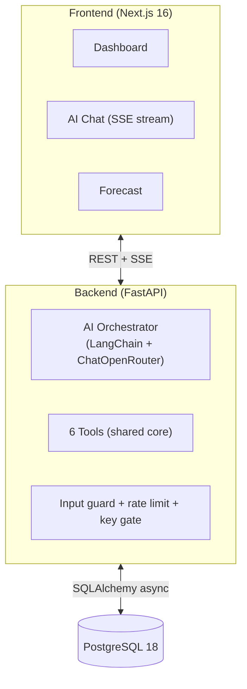

# AI-Powered Logistics Analytics Dashboard

> **Live demo:** https://ai-logistics-analytics.huahongquan.com/
>
> **Chat access key:** request via **quanhua92@gmail.com** (the chat endpoint is gated; the dashboard and forecast pages are open).

An interactive analytics platform for a shipping company — ask questions in plain English, get answers with live charts, and forecast demand. Built as a coding challenge demonstrating full-stack development, responsible AI orchestration, and statistical forecasting.

**Three levels of intelligence:**
1. **Dashboard** — KPIs, charts, and a 32-scenario explorer
2. **AI Chat** — streaming natural-language queries with charts, explanations, and tool-call visibility
3. **Forecasting** — three statistical methods (linear regression, moving average, exponential smoothing) with fitted lines and inventory recommendations

---

## Tech Stack

| Layer | Technology |
|---|---|
| Frontend | Next.js 16, TypeScript, Tailwind CSS 4, shadcn/ui (Base UI), Recharts |
| Backend | FastAPI (Python 3.13), SQLAlchemy (async), Alembic |
| Database | PostgreSQL 18 |
| AI | LangChain + ChatOpenRouter (any OpenAI-compatible model), tool-calling via `bind_tools` + `astream` |
| Forecasting | Pure statistics — no ML libraries |

---

## Quick Start (Local Dev)

### Prerequisites

- **Docker** (for PostgreSQL, or the full stack)
- **Python 3.13+** with [`uv`](https://docs.astral.sh/uv/) (`pip install uv`) — local dev only
- **Node.js 22+** with `pnpm` (`corepack enable pnpm`) — local dev only

### Option A — Docker (full stack, no local setup)

Runs all three services (PostgreSQL + FastAPI + Next.js) in containers:

```bash
cp server/.env.example server/.env     # fill in OPENROUTER_API_KEY
docker compose up -d --build           # builds + starts all 3 containers
```

- **App:** http://localhost:3000
- **API:** http://localhost:8000/api/health
- **Stop:** `docker compose down`

The server auto-runs migrations + seeds the data on startup. Chat logs persist in a Docker volume.

### Option B — Local dev (PostgreSQL in Docker, backend + frontend on host)

```bash
# 1. Start PostgreSQL only
docker compose up -d postgres

# 2. Backend
cd server
cp .env.example .env          # fill in OPENROUTER_API_KEY
uv sync                       # install deps
uv run alembic upgrade head   # create schema
uv run python data/seed.py    # load 400 orders from CSV
uv run uvicorn app.main:app --reload --port 8000

# 3. Frontend (in another terminal)
cd web
pnpm install
pnpm dev                      # http://localhost:3000
```

Or use the all-in-one dev launcher (starts postgres + backend + frontend on the host):

```bash
./scripts/run-all.sh           # start everything
./scripts/run-all.sh --stop    # stop everything
```

### Environment Variables

**`server/.env`** (see `.env.example`):

| Variable | Required | Description |
|---|---|---|
| `DATABASE_URL` | yes | PostgreSQL connection string |
| `OPENROUTER_API_KEY` | yes | OpenRouter API key (https://openrouter.ai/keys) |
| `OPENROUTER_BASE_URL` | no | Defaults to `https://openrouter.ai/api/v1` |
| `OPENROUTER_MODEL` | no | Defaults to `openrouter/free` (auto-routes to free models) |
| `CHAT_ACCESS_KEY` | no | Comma-separated shared keys for the chat gate (empty = open in dev) |
| `CHAT_LOG_DIR` | no | Per-conversation JSONL log directory (default `.chat-logs`) |
| `CORS_ORIGINS` | no | Comma-separated allowed origins |

**`web/`** — no env file needed in dev (the catch-all Route Handler defaults `BACKEND_URL` to `http://localhost:8000`). For Docker/production, set `BACKEND_URL` at runtime (e.g. `http://server:8000` for the Docker service name).

---

## Deployment — Two Containers

The server and web are deployed as **two separate containers**, each with its own Dockerfile:

| Container | Dockerfile | Port | Notes |
|---|---|---|---|
| **Backend** | `server/Dockerfile` | 8000 | FastAPI + uvicorn, `--proxy-headers` for reverse-proxy deployments |
| **Frontend** | `web/Dockerfile` | 3000 | Next.js standalone production build |

PostgreSQL can be a managed instance (Railway, Render, Supabase) or a third container. A reverse proxy (Caddy, nginx) fronts both containers and handles TLS.

```bash
# Build
docker build -t logistics-api ./server
docker build -t logistics-web ./web

# Run (example — adjust env + network for your platform)
docker run -p 8000:8000 --env-file server/.env logistics-api
docker run -p 3000:3000 -e BACKEND_URL=http://logistics-api:8000 logistics-web
```

---

## Architecture



**Key design decisions:**

- **AI as router, not source of truth** — the LLM never fabricates numbers. It picks a tool, the backend computes the real answer, and the LLM narrates it.
- **One tool core, two surfaces** — the dashboard (REST) and the chat (LangChain tool-calling) share the same 6 tools in `app/tools/`. No duplicated logic.
- **Safe query builder** — the LLM sends structured specs (`{metric, group_by, filters}`); the backend validates every field against an allowlist and builds parameterized SQLAlchemy. No raw AI SQL is ever executed.
- **SSE streaming** — the answer, tool calls, and reasoning stream live via Server-Sent Events (`POST /api/chat/stream`), proxied through a Next.js Route Handler to avoid buffering.
- **Defense in depth** — input guard (injection patterns), per-instance rate limit (30/min), and a prototype access-key gate (SHA-256 hashed, multi-key, rotation-friendly).

See [`OVERVIEW.md`](./OVERVIEW.md) for the full architecture guide with diagrams and the 33-scenario catalog.

---

## AI Approach

### How questions are interpreted

The orchestrator builds a system prompt at runtime containing:
- Static rules (always use a tool before citing numbers; prefer curated scenarios; ask one clarifying question if ambiguous; never emit markdown images)
- The **full 33-scenario catalog** generated from the registry (so the model can route most questions without an extra round-trip)
- Tool descriptions for all 6 tools

The model reads the question + conversation history and picks a tool via LangChain's `bind_tools`.

### How tools are selected

| Tool | When the model uses it |
|---|---|
| `run_scenario(id)` | A curated scenario matches (most common questions) |
| `query_analytics(metric, group_by, filters, chart_type)` | Ad-hoc aggregation no scenario covers; `chart_type` lets the model pick the visualization |
| `list_orders(filters, limit)` | "List / show recent orders" (raw rows) |
| `plot_data(data, chart_type, x, y)` | "Visualize / plot" data already retrieved |
| `forecast_demand(category, horizon)` | Demand prediction (pure statistics, 3 methods) |
| `list_scenarios()` / `list_forecast_categories()` | Discovery (rarely needed — catalog is in the prompt) |

### Safety

- **No raw SQL** — structured specs validated against allowlists (fields, operators, chart types)
- **Input guard** — blocks prompt-injection patterns before the LLM sees the question
- **Rate limit** — 30 chat requests/minute per server instance
- **Key gate** — prototype shared-key auth (SHA-256 hashed client-side, multi-key rotation)

---

## Forecasting

Pure statistics — no machine learning. Three methods computed on monthly historical demand:

1. **Linear regression** — least-squares trend line (fitted over history + projected)
2. **3-month moving average** — trailing window (fitted over history + held forward)
3. **Exponential smoothing** (alpha=0.3) — running level (fitted over history + held forward)

Each method renders as a **continuous fitted line** spanning history + forecast, overlaid on the actual data. The exponential-smoothing projection is the primary forecast; all three are shown for comparison. An inventory recommendation (peak + 20% safety margin) is included.

Available at `/forecast` (direct form, no AI) and via the chat's `forecast_demand` tool.

---

## Assumptions

- **Single-user** — no multi-tenant isolation; the chat key gate is a shared key, not per-user auth
- **Read-only data** — no CRUD operations; the dataset is static
- **English-only** natural-language queries
- **Monthly forecasting** granularity (categories have enough volume; individual SKUs are mostly one-offs)
- **Dataset covers Jan–Dec 2025** — "last month" means 2025-12
- **In-memory rate limiting** — the counter resets on server restart (fine for single-instance)

---

## Limitations

- **Free-tier model latency** — `openrouter/free` routes to free models which can be slow or occasionally return empty (the orchestrator retries up to 3× on empty responses)
- **Chat logs are ephemeral on serverless** — the JSONL logs are written to the filesystem; on a serverless deploy they won't persist across cold starts (use a volume or external storage for production)
- **No streaming for the tool-calling phase** — the model's tool decisions aren't streamed (only the final answer is); there's a brief "Thinking…" pause while tools execute
- **No per-user auth** — the key gate is prototype-grade (shared key, hashed); real deployment needs proper user authentication
- **MCP not built** — external AI clients can't connect (the tool core exists; wiring is deferred since external clients can't render charts)

---

## Future Improvements

- **Proper user authentication** (OAuth/JWT instead of shared key)
- **Per-IP rate limiting** (switch from global to `get_remote_address` once behind a trusted proxy with `--proxy-headers`)
- **MCP adapter** — expose tools to external AI clients (the shared core exists; the value is limited since they can't render charts)
- **Query caching** — cache dashboard KPIs/charts with a TTL
- **Streaming tool decisions** — show the model's tool-selection reasoning live
- **Export to CSV** — download chart data
- **Date-range filtering** on the dashboard
- **Advanced explainability** — execution time, query-plan JSON

---

## Project Structure

```
spaceship/
├── server/                    # FastAPI backend
│   ├── app/
│   │   ├── main.py            # App entry (CORS, routers, lifespan)
│   │   ├── config.py          # Settings (env vars)
│   │   ├── db.py              # Async engine + session
│   │   ├── models.py          # SQLAlchemy ORM (Order)
│   │   ├── routers/
│   │   │   ├── dashboard.py   # KPIs + chart endpoints
│   │   │   ├── chat.py        # /api/chat + /api/chat/stream (SSE) + replay
│   │   │   └── forecast.py    # /api/forecast (pure stats)
│   │   ├── scenarios/         # 32-scenario registry + runner
│   │   ├── services/
│   │   │   ├── ai_orchestrator.py  # LangChain tool-calling loop
│   │   │   └── forecasting.py      # 3-method statistical forecast
│   │   ├── tools/             # Shared tool core (6 tools)
│   │   ├── utils/             # Input guard, chart selector, chat log, explainability
│   │   └── ratelimit.py       # slowapi global rate limiter
│   ├── data/
│   │   ├── logistics_data.csv # Source dataset (400 orders)
│   │   ├── seed.py            # CSV → PostgreSQL
│   │   └── explorer.py        # Data exploration + scenario discovery
│   ├── migrations/            # Alembic
│   └── Dockerfile
├── web/                       # Next.js 16 frontend
│   ├── src/
│   │   ├── app/
│   │   │   ├── page.tsx       # Dashboard (/)
│   │   │   ├── explore/       # All 32 scenarios (/explore)
│   │   │   ├── chat/          # AI chat (/chat)
│   │   │   ├── forecast/      # Demand forecast (/forecast)
│   │   │   └── api/chat/stream/route.ts  # SSE proxy (Route Handler)
│   │   ├── components/
│   │   ├── hooks/
│   │   └── lib/
│   └── Dockerfile
├── docker-compose.yml         # PostgreSQL + server + web (full stack)
├── scripts/run-all.sh         # Dev launcher (backend + frontend + postgres)
├── OVERVIEW.md                # Detailed architecture guide
└── README.md                  # This file
```
